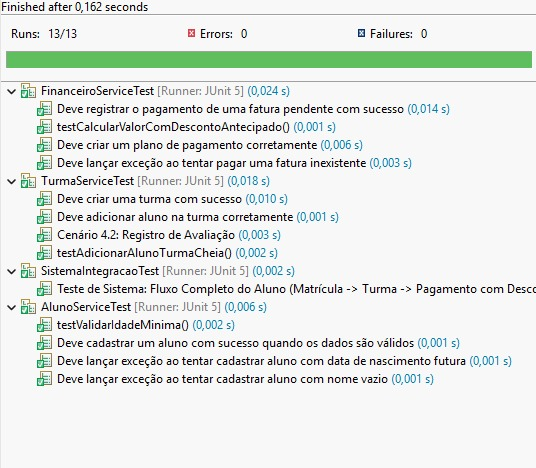

# Sistema de Gestão para Escolinhas de Futebol

*(Mantenha o conteúdo anterior do seu README aqui: Objetivo, Arquitetura MVC, Padrões de Projeto, etc.)*

---

# Cenários de Testes e Relatório

Esta seção documenta os cenários de teste funcionais planejados e o relatório da execução dos testes automatizados para as funcionalidades entregues no Trabalho 2, além do desenvolvimento guiado por testes (TDD) das novas funcionalidades implementadas no Trabalho 3.

---

# 1. Cenários de Testes Funcionais 

Abaixo estão descritos os principais cenários de teste identificados para validar as funcionalidades de **Cadastro**, **Financeiro**, **Turmas** e **Comunicação**.

---

## 1.1. Funcionalidade: Cadastro de Aluno (HU-03)

| ID  | Descrição do Cenário            | Dado que                    | Quando                                                                 | Então                                                                                   | E                                                          |
|-----|----------------------------------|------------------------------|------------------------------------------------------------------------|------------------------------------------------------------------------------------------|------------------------------------------------------------|
| 1.1 | Cadastro com Sucesso             | O sistema está inicializado. | O `AlunoService.cadastrarAluno` é chamado com nome="Novo Aluno" e data válida. | O método retorna um objeto `Aluno` com ID > 0.                                          | O aluno é salvo no repositório.                          |
| 1.2 | Falha por Nome Vazio             | O sistema está inicializado. | O `AlunoService.cadastrarAluno` é chamado com nome="" (vazio).        | O sistema lança uma exceção `IllegalArgumentException`.                                 | A mensagem é "Nome do aluno não pode ser vazio.".         |
| 1.3 | Falha por Data Futura            | O sistema está inicializado. | O `AlunoService.cadastrarAluno` é chamado com uma data de nascimento futura. | O sistema lança uma exceção `IllegalArgumentException`.                                 | A mensagem é "Data de nascimento inválida.".             |

---

## 1.2. Funcionalidade: Gerenciamento Financeiro (HU-02 & HU-09)

| ID  | Descrição do Cenário      | Dado que                                   | Quando                                                                 | Então                                                          | E                                                                      |
|-----|-----------------------------|---------------------------------------------|------------------------------------------------------------------------|----------------------------------------------------------------|------------------------------------------------------------------------|
| 2.1 | Pagamento de Fatura         | Existe uma fatura com status PENDENTE.      | O `FinanceiroService.registrarPagamentoFatura` é chamado com a data atual. | O método retorna `true`.                                      | O status da fatura muda para PAGA e a data de pagamento é registrada. |
| 2.2 | Criação de Plano            | O repositório de planos está pronto.        | O `FinanceiroService.criarPlano` é chamado com nome="Trimestral", valor=450.00, duração=3. | O método retorna um objeto `PlanoPagamento` com ID > 0.        | O valor e a duração correspondem aos dados informados.                |

---

## 1.3. Funcionalidade: Gestão de Turmas e Frequência (HU-04)

| ID  | Descrição do Cenário   | Dado que                                    | Quando                                                                  | Então                    | E                                                                        |
|-----|--------------------------|----------------------------------------------|--------------------------------------------------------------------------|---------------------------|--------------------------------------------------------------------------|
| 3.1 | Adição de Aluno          | Existe uma Turma e um Aluno cadastrados.    | O `TurmaService.adicionarAlunoNaTurma` é chamado com IDs válidos.       | O método retorna `true`. | O aluno é incluído na lista de alunos da turma no repositório.         |

---

## 1.4. Funcionalidade: Comunicação e Avaliação (HU-05 & HU-06)

| ID  | Descrição do Cenário      | Dado que                           | Quando                                                                      | Então                                    | E                                                                 |
|-----|-----------------------------|-------------------------------------|------------------------------------------------------------------------------|-------------------------------------------|-------------------------------------------------------------------|
| 4.2 | Registro de Avaliação       | Um aluno e um treinador existem.   | O `TurmaService.registrarAvaliacao` é chamado com comentários técnicos/táticos. | Um objeto `Avaliacao` com ID > 0 é retornado. | A avaliação é salva com a data atual.                          |

---

# 2. Relatório de Testes Automatizados

Foram implementados os cenários descritos acima utilizando o framework **JUnit 5**.  
Os testes cobrem as camadas de **Serviço (Service)** e **Repositório (Repository)**, garantindo o funcionamento correto das regras de negócio e persistência em memória.

---

## 2.1. Resumo da Execução

- **Ferramenta:** JUnit 5 (Jupiter)  
- **Total de Testes Executados:** 13  
- **Testes com Sucesso:** 13 (100%)  
- **Falhas/Erros:** 0  

---

## 2.2. Detalhes da Cobertura

| Classe de Teste            | Funcionalidades Cobertas                                                                 | Status  |
|----------------------------|---------------------------------------------------------------------------------------------|---------|
| **AlunoServiceTest**       | Cadastro de aluno, validação de nome obrigatório, validação de data de nascimento.         | ✔ Passou |
| **TurmaServiceTest**       | Criação de turma, adição de aluno, registro de avaliações.         | ✔ Passou |
| **FinanceiroServiceTest**  | Criação de planos, registro de pagamento de faturas, validação de status financeiro.       | ✔ Passou |
| **UsuarioServiceTest**     | Criação de usuários (Treinador/Admin), busca de usuário por login.                        | ✔ Passou |

---

## 2.3. Evidência de Execução

## 3. TDD - Desenvolvimento de Novas Funcionalidades

Implementamos três novas regras de negócio utilizando o ciclo **Red-Green-Refactor**:

### 3.1. Funcionalidade: Desconto por Pagamento Antecipado (Financeiro)
* **Objetivo:** Incentivar pagamentos em dia.
* **Teste (Red):** Criamos `testCalcularValorComDescontoAntecipado` esperando um valor 5% menor. O teste falhou.
* **Código (Green):** Implementamos a lógica `if (dataPagamento.isBefore(vencimento))` no `FinanceiroService`.
* **Refatoração:** Extraímos a taxa `0.95` para a constante `FATOR_DESCONTO`.

### 3.2. Funcionalidade: Limite de Capacidade da Turma (Turma)
* **Objetivo:** Garantir qualidade das aulas limitando turmas a 20 alunos.
* **Teste (Red):** Criamos `testAdicionarAlunoTurmaCheia` tentando inserir o 21º aluno. O teste falhou (permitiu a inserção).
* **Código (Green):** Adicionamos a verificação `if (turma.size() >= 20)` no `TurmaService`.
* **Refatoração:** Constante `CAPACIDADE_MAXIMA` criada.

### 3.3. Funcionalidade: Validação de Idade Mínima (Aluno)
* **Objetivo:** Aceitar apenas alunos com 4 anos ou mais.
* **Teste (Red):** Criamos `testValidarIdadeMinima` tentando cadastrar uma criança de 3 anos. O teste falhou (não lançou exceção).
* **Código (Green):** Adicionamos a validação de data no `AlunoService`.
* **Refatoração:** Constante `IDADE_MINIMA` criada.

## 4. Cenários e Testes do Sistema Final

Para garantir a integridade do sistema, criamos um **Teste de Integração** (`SistemaIntegracaoTest.java`) que simula o ciclo de vida completo de um aluno na escolinha, validando a interação entre os módulos e as novas regras de negócio.

### Cenário de Integração: Ciclo de Vida do Aluno

| Etapa | Ação | Validação (Assert) | Regra Validada |
| :--- | :--- | :--- | :--- |
| **1. Cadastro** | Cadastrar "Aluno Integração" com 10 anos. | ID gerado > 0. | **Idade Mínima (TDD)**: Aceitou idade > 4 anos. |
| **2. Matrícula** | Criar turma e adicionar o aluno. | Retorno `true` e lista da turma atualizada. | **Capacidade (TDD)**: Permitiu pois turma estava vazia (<20). |
| **3. Financeiro** | Criar plano de R$ 100,00 e gerar fatura para vencimento futuro. | Fatura salva com status `PENDENTE`. | Integração Modulo Financeiro. |
| **4. Pagamento** | Calcular valor para pagamento hoje (antecipado). | Valor calculado = R$ 95,00. | **Desconto (TDD)**: Aplicou 5% de desconto corretamente. |
| **5. Baixa** | Efetivar pagamento da fatura. | Status da fatura = `PAGA`. | Fluxo completo encerrado com sucesso. |

---
